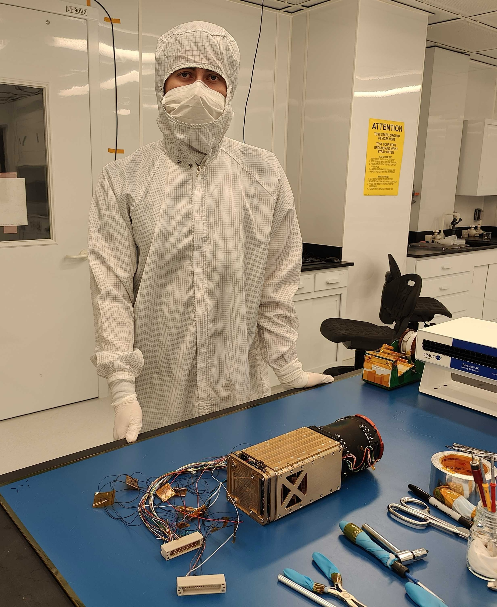
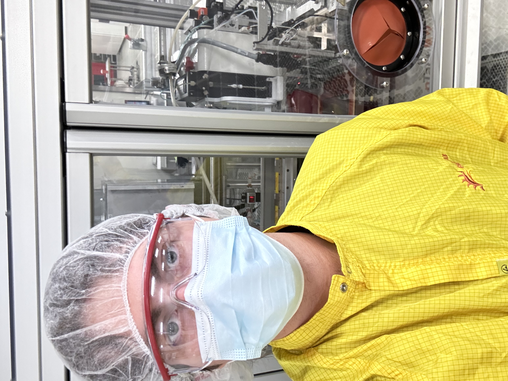

# Zachary Felty

My name is Zachary Felty and I am a graduate of the Robotics Engineering undergraduate program at Arizona State University. I am currently pursuing an MS in Electrical Engineering to further my knowledge and achievment. To give some background, my interest in engineering started as a passion for music. Growing up, I loved the electric guitar and experimenting with sound synthesization. As I dove deeper into the world of sound I strove to understand the electronic systems involved. This curiosity sparked a love for electronics, physics, robotics, and system design that eventually pushed me to pursue multiple degrees in engineering.

## Skills
- Skill 1
- Skill 2
- Skill 3

## Projects
### Project Title
A short description of the project.

### Project Title 2
Another short description.

### Project Title 3

## Contact
- Email: your-email@example.com
- LinkedIn: [Your LinkedIn](https://linkedin.com/in/yourprofile)
